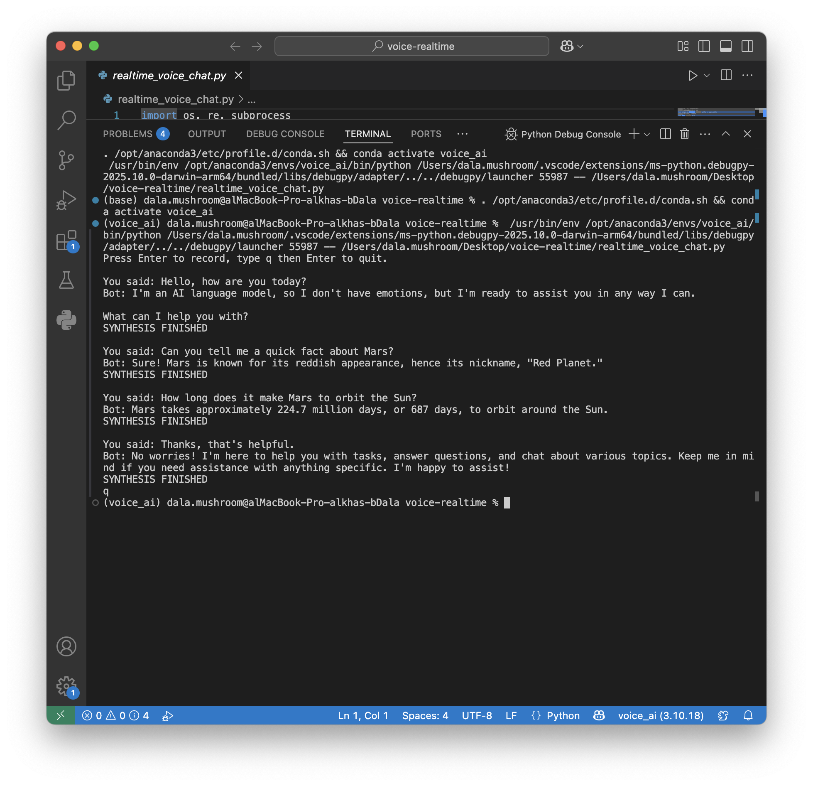

# Voice Realtime Chatbot

This project records voice input, converts it to text, and responds using AI (Cohere API).  
It then converts the AI's reply back to speech in real-time.

## How it works
1. Records audio from the microphone.
2. Transcribes the audio into text.
3. Sends the text to Cohere API for a response.
4. Converts the response back into speech.
5. Plays the audio reply.

## Output
### Screenshot


### Demo Video
[Output Demo](output_demo.mp4)

## Requirements
- Python 3.10+
- Cohere API Key
- ffmpeg

## Run
```bash
python realtime_voice_chat.py